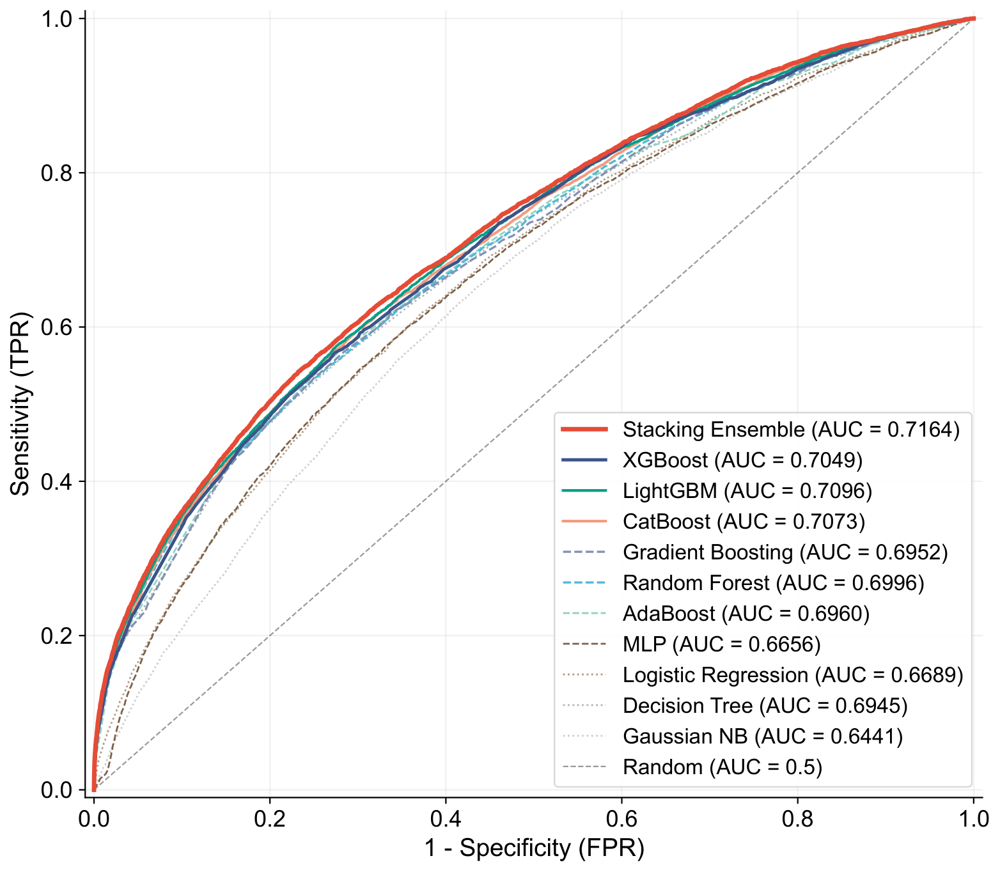
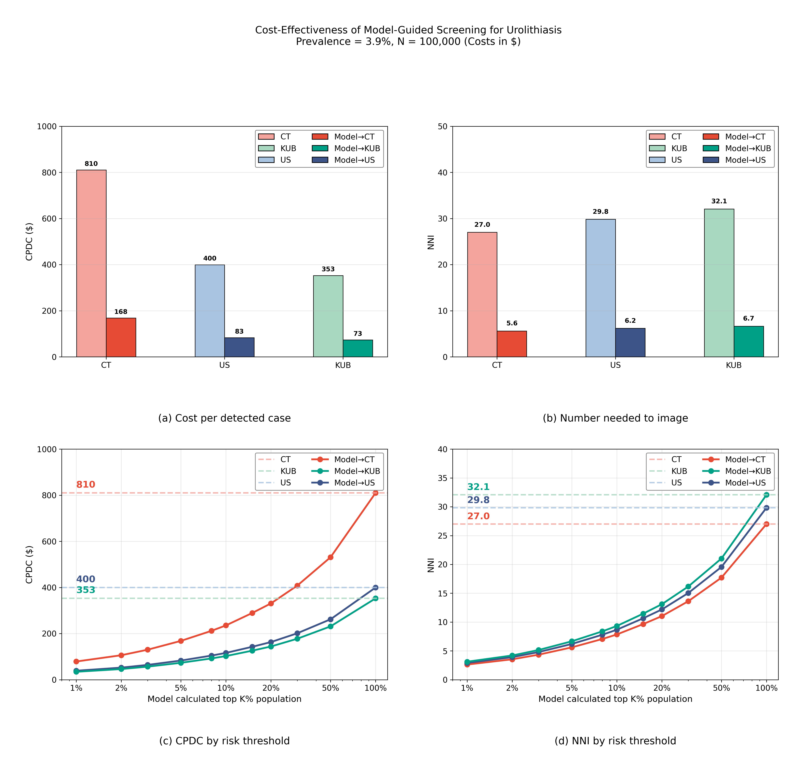

# **Population-scale Screening for Urolithiasis Using Ensemble Machine Learning on Non-imaging Biomarkers from Routine Health Check-ups: A Multicentre Retrospective Study**

<p align="center">
  
  
  
  
</p>

**West China Hospital, Sichuan University · Department of Urology**

---

## News

- **2026.07.25** — Online risk calculator launched with 87-dimensional SHAP real-time explanation
- **2026.07.20** — External validation completed; Stacking AUROC **0.7164**
- **2026.07.18** — UroScreen codebase and dataset released

---

## Key Results

| Metric | Value |
|--------|-------|
| Total Sample Size | **799,824** health check-up individuals |
| External Validation | **181,336** independent samples from 3 centres |
| Internal AUROC | **0.7164** (Stacking XGBoost) |
| External AUROC (pooled) | **0.6939** (Wuhou, n=111,523) |
| Feature Dimension | **77** routine health examination biomarkers |
| Cost Reduction | **−79.3%** (Top-5% cost per detected case) |

---

## Model Architecture

```
┌─────────────────────────────────────────────────────────────────┐
│             77 Routine Health Examination Biomarkers             │
│  (Blood · Urinalysis · Liver Function · Renal Function          │
│   Lipids · Anthropometry · Vital Signs)                         │
└───────────────────────────┬─────────────────────────────────────┘
                            │
                            ▼
┌─────────────────────────────────────────────────────────────────┐
│         10 Heterogeneous Base Learners (5-Fold OOF)             │
│                                                                 │
│  LightGBM   XGBoost    CatBoost    GradientBoosting            │
│  LogisticRegression   GaussianNB   DecisionTree                 │
│  RandomForest   AdaBoost   MLP                                  │
└───────────────────────────┬─────────────────────────────────────┘
                            │  10 OOF probabilities
                            ▼
┌─────────────────────────────────────────────────────────────────┐
│           XGBoost Meta-Learner (87-Dimensional Input)           │
│            10 OOF Probabilities + 77 Raw Features               │
└───────────────────────────┬─────────────────────────────────────┘
                            │
                            ▼
┌─────────────────────────────────────────────────────────────────┐
│                     Platt Probability Calibration                │
└───────────────────────────┬─────────────────────────────────────┘
                            │
                            ▼
┌─────────────────────────────────────────────────────────────────┐
│           87-Dimensional SHAP Interpretability Analysis          │
│     (SHAP attribution performed on the meta-model's original     │
│                       marginal space)                            │
└─────────────────────────────────────────────────────────────────┘
```

---

## Performance

All metrics computed at the optimal threshold determined by Youden's J statistic on the internal validation set (n = 239,947).

### Internal Validation (n = 239,947)

| Model | AUROC | AUPRC | Sensitivity | Specificity | PPV | NPV | F1 |
|-------|:-----:|:-----:|:-----------:|:-----------:|:---:|:---:|:--:|
| **Stacking Ensemble** | **0.7164** | **0.2411** | 0.5422 | 0.7678 | 0.0865 | **0.9764** | 0.1492 |
| LightGBM | 0.7096 | 0.2301 | 0.5751 | 0.7247 | 0.0781 | 0.9768 | 0.1375 |
| CatBoost | 0.7073 | 0.2264 | 0.5954 | 0.7016 | 0.0749 | 0.9771 | 0.1330 |
| XGBoost | 0.7049 | 0.2226 | 0.5668 | 0.7264 | 0.0775 | 0.9764 | 0.1364 |
| Random Forest | 0.6996 | 0.2125 | 0.5337 | 0.7492 | 0.0795 | 0.9754 | 0.1383 |
| AdaBoost | 0.6960 | 0.2078 | 0.5698 | 0.7198 | 0.0762 | 0.9763 | 0.1344 |
| Gradient Boosting | 0.6952 | 0.2070 | 0.5687 | 0.7152 | 0.0749 | 0.9761 | 0.1324 |
| Decision Tree | 0.6945 | 0.2040 | 0.5051 | 0.7743 | 0.0832 | 0.9747 | 0.1429 |
| Logistic Regression | 0.6689 | 0.1707 | 0.6188 | 0.6271 | 0.0631 | 0.9759 | 0.1145 |
| MLP | 0.6656 | 0.1661 | 0.5964 | 0.6475 | 0.0642 | 0.9753 | 0.1159 |
| Gaussian NB | 0.6441 | 0.1472 | 0.6480 | 0.5685 | 0.0574 | 0.9755 | 0.1055 |

### External Validation (n = 181,336)

| Centre | n | Model | AUROC | Sensitivity | Specificity |
|--------|:--:|-------|:-----:|:-----------:|:-----------:|
| Wuhou | 111,523 | Stacking Ensemble | 0.6939 | 0.5360 | 0.7505 |
| Wuhou | 111,523 | XGBoost | 0.6847 | 0.4764 | 0.7897 |
| Shangjin | 24,828 | Stacking Ensemble | 0.6889 | 0.5412 | 0.7474 |
| Shangjin | 24,828 | XGBoost | 0.6700 | 0.5102 | 0.7377 |
| Tianfu | 43,346 | Stacking Ensemble | 0.6867 | 0.5161 | 0.7628 |
| Tianfu | 43,346 | XGBoost | 0.6818 | 0.4743 | 0.7891 |

---

## Key Figures

### ROC Curves

<p align="center">
  
</p>

*ROC curves of the stacking ensemble and all base learners on the internal validation set.*

### SHAP Explainability

<p align="center">
  
</p>

*SHAP-based feature importance ranking with 87-dimensional model interpretability.*

### Cost-Effectiveness Analysis

<p align="center">
  
</p>

*Model-guided Top-5% risk stratification reduces cost per detected case by 79.3%.*

---

## Dataset

| Dataset | Samples | Prevalence | Source | Purpose |
|---------|:------:|:----------:|--------|---------|
| Training Set | 559,877 | 4.2% | Health Check-up Centre A | Model training & 5-fold cross-validation |
| Internal Validation | 239,947 | 4.2% | Health Check-up Centre A | Internal performance evaluation |
| External Validation | 181,336 | 3.1% | Centre B (independent, 3 sites) | External generalisation validation |
| **Total** | **981,160** | — | — | — |

---

## Quick Start

- **Online Demo**: **[UroScreen Risk Calculator](https://duxingx1a.github.io/uro-screen/demo.html)** — real-time risk prediction with SHAP explanation
- **Project Page**: **[https://duxingx1a.github.io/uro-screen/index.html](https://duxingx1a.github.io/uro-screen/index.html)**
