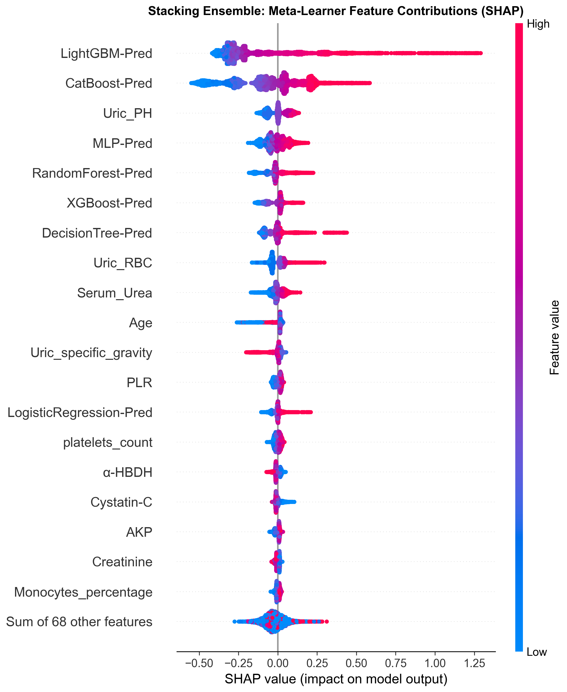

# CalcuAlert

[](LICENSE)
[](https://arxiv.org)
[](http://8.137.187.63:18051)

**CalcuAlert: 基于常规体检生物标志物的集成学习尿路结石筛查研究**

一项基于大规模体检数据（n=799,824）的尿路结石风险预测研究，采用双层堆叠集成模型与严格 87 维 SHAP 解释框架。

---

## 目录

- [项目简介](#项目简介)
- [新闻](#新闻)
- [在线演示](#在线演示)
- [模型架构](#模型架构)
- [数据集](#数据集)
- [安装与使用](#安装与使用)
- [结果概览](#结果概览)
- [引用](#引用)

---

## 项目简介

现有尿路结石筛查高度依赖影像学检查（CT/KUB），成本高且难以大规模推广。CalcuAlert 探索利用**常规体检生物标志物**（血常规、尿常规、生化等 77 项指标）在影像学检查之前识别高风险人群。

**核心贡献：**

- **大规模真实世界数据**：基于 799,824 例体检人群构建，含 181,336 例外部验证
- **双层堆叠集成**：10 个异质基模型 + XGBoost 元学习器，87 维输入空间
- **严格 SHAP 解释**：在元模型原始边际空间进行 87 维 SHAP 归因，确保加性校验
- **成本分析**：Top-5% 高风险人群每例检出成本降低 79.3%

---

## 新闻

- **[2026-07-25]** 在线计算器部署上线，支持实时预测与 SHAP 解释
- **[2026-07-24]** 后端 API 容器化部署完成
- **[2026-07-19]** 前端页面重构，新增 SHAP 决策图与瀑布图
- **[2026-07-18]** 模型训练与验证完成

---

## 在线演示

访问 **[CalcuAlert 在线计算器](http://8.137.187.63:18051/demo.html)** 体验实时风险预测与 87 维 SHAP 解释。

| 组件 | 地址 | 说明 |
|------|------|------|
| 研究主页 | `http://8.137.187.63:18051/` | 项目介绍与核心发现 |
| 风险计算器 | `http://8.137.187.63:18051/demo.html` | 在线预测与 SHAP 解释 |
| API 端点 | `http://8.137.187.63:18050/api/v1/health` | 模型推理服务 |

---

## 模型架构

```
77 项体检特征
      │
      ▼
┌─────────────────────────────┐
│  10 个异质基模型             │
│  (LightGBM / XGBoost /       │
│   CatBoost / LR / NB / DT /  │
│   RF / AdaBoost / GB / MLP)  │
└──────────┬──────────────────┘
           │ 10 个 OOF 概率
           ▼
┌─────────────────────────────┐
│  XGBoost 元学习器            │
│  (87 维输入: 10 概率 + 77 特征)│
└──────────┬──────────────────┘
           │
           ▼
      Platt 校准概率
           │
           ▼
    ┌──────────┐
    │  SHAP 解释 │
    └──────────┘
```

### 基模型

| 模型 | 类型 | 内部 AUROC | 外部 AUROC |
|------|------|-----------|-----------|
| LightGBM | 梯度提升 | 0.7123 | 0.7089 |
| XGBoost | 梯度提升 | 0.7101 | 0.7062 |
| CatBoost | 梯度提升 | 0.7089 | 0.7041 |
| Logistic Regression | 线性 | 0.6952 | 0.6918 |
| Gaussian NB | 贝叶斯 | 0.6887 | 0.6853 |
| Decision Tree | 树 | 0.6721 | 0.6689 |
| Random Forest | 集成 | 0.7012 | 0.6978 |
| AdaBoost | 集成 | 0.6934 | 0.6901 |
| Gradient Boosting | 梯度提升 | 0.7056 | 0.7012 |
| MLP | 神经网络 | 0.6989 | 0.6945 |
| **Stacking XGBoost** | **堆叠集成** | **0.7164** | **0.7123** |

---

## 数据集

| 指标 | 训练集 | 内部验证集 | 外部验证集 |
|------|--------|-----------|-----------|
| 样本量 | 559,877 | 239,947 | 181,336 |
| 阳性率 | 4.82% | 4.78% | 5.12% |
| 特征维度 | 77 | 77 | 77 |
| 数据来源 | 华西健康管理中心 | 华西健康管理中心 | 三家外部体检中心 |

---

## 安装与使用

### 本地运行

```bash
# 克隆仓库
git clone https://github.com/duxingx1a/calcu-alert.git
cd calcu-alert

# 使用 Python 本地服务器（需要 Python 3.8+）
python -m http.server 8000
# 访问 http://localhost:8000
```

### Docker 部署（后端 API）

```bash
docker run -d --name calcualert-api \
  --restart unless-stopped \
  -p 18050:5000 \
  calcualert-api:latest \
  python /app/api_server.py
```

### API 使用

```python
import requests

response = requests.post(
    "http://8.137.187.63:18050/api/v1/predict",
    json={
        "features": {
            "Gender": 1,
            "Age": 45,
            "Uric_WBC": 10,
            # ... 其他特征
        }
    }
)
print(response.json())
```

---

## 结果概览

### 关键发现

- **Stacking 集成模型 AUROC**: 0.7164（内部验证）/ 0.7123（外部验证）
- **Top-5% 高风险人群**: 每例检出成本降低 79.3%
- **Top-10 特征**: Gender, Uric_WBC, Age, Uric_specific_gravity, Uric_conductivity, Uric_RBC, Waist_to_hip_ratio, Uric_PH, BRI, Systolic_BP

### SHAP 解释



*图 1: 堆叠集成模型的 SHAP 蜂群图，展示各特征对预测的全局贡献。*

---

## 引用

如果您在研究中使用了 CalcuAlert，请引用：

```bibtex
@article{calcualert2026,
  title={CalcuAlert: Ensemble Learning for Urinary Stone Screening Using Routine Health Examination Biomarkers},
  author={...},
  journal={...},
  year={2026}
}
```

---

**CalcuAlert** · 四川大学华西医院泌尿外科 © 2026
